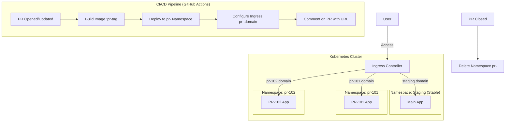

# Task 3: Safer PR Testing with Preview Environments - Design Document

## 1. Context & Problem Statement

In a shared Kubernetes staging environment (monorepo or microservices), testing Pull Requests (PRs) before merging is challenging:
*   **Conflict & Instability**: Deploying a PR directly to a shared `staging` namespace can overwrite the stable version, potentially blocking other developers or breaking integration tests for everyone.
*   **Queueing**: Using a merge queue or "lock" on the staging environment slows down development velocity.

**Objective**: Enable isolated, full-stack testing for every PR without disrupting the shared staging environment.

## 2. Solution: Ephemeral Namespaces

We propose using **Ephemeral Namespaces** (also known as Dynamic Preview Environments) as the isolation boundary.

### 2.1 Core Concept
Instead of maintaining a fixed set of environments (dev, staging, prod), we treat environments as **disposable resources** tied to the lifecycle of a Pull Request.

*   **Creation**: When a PR is opened, a new Kubernetes Namespace `pr-<ID>` is created.
*   **Isolation**: All resources for that PR (Deployments, Services, ConfigMaps) are deployed strictly within that namespace.
*   **Access**: A dynamic Ingress route is generated (e.g., `pr-<ID>.staging.example.com`) to allow distinct access to that specific version.
*   **Cleanup**: When the PR is closed or merged, the namespace is automatically deleted.

### 2.2 Architecture Diagram

## 3. Implementation Details

### 3.1 CI/CD Wiring
We implement this using two GitHub Actions workflows:

1.  **`pr-preview.yml`** (Triggers: `opened`, `synchronize`, `reopened`)
    *   **Build**: Builds Docker image with tag `pr-<number>-<sha>`.
    *   **Deploy**:
        *   Creates Namespace `pr-<number>` (idempotent).
        *   Injects image tag into manifests (`kustomize` or `sed`).
        *   Applies manifests to the new namespace.
    *   **Route**: Applies an Ingress resource with `host: pr-<number>.staging.example.com`.
    *   **Feedback**: Bot comments on the PR with the clickable Preview link.

2.  **`pr-cleanup.yml`** (Triggers: `closed`)
    *   Executes `kubectl delete namespace pr-<number>`.
    *   Ensures no orphaned resources remain in the cluster.

### 3.2 Assumptions & Prerequisites
*   **Wildcard DNS**: A DNS record `*.staging.example.com` pointing to the cluster's Ingress Controller LoadBalancer.
*   **Resource Quota**: The cluster has sufficient capacity (CPU/Memory) to host multiple concurrent PR environments.
*   **Statelessness**: The current service is stateless. (See Future Work for stateful handling).

## 4. Trade-offs & Alternatives

| Approach | Pros | Cons | Verdict |
| :--- | :--- | :--- | :--- |
| **Ephemeral Namespaces** (Chosen) | Strong isolation; Easy cleanup; Mirrors prod layout. | Higher resource usage; Namespace setup overhead. | **Best Balance** |
| **Shared Namespace + Canary** | Low resource usage. | Complex routing (header-based); Risk of config collisions. | Too risky for staging. |
| **Dedicated Clusters** | Perfect isolation. | Extremely slow & expensive; Hard to manage. | Overkill. |

## 5. Future Work (Stateful Services)

For services depending on databases (Stateful), this design needs extension:
1.  **Ephemeral DB**: Spin up a temporary Postgres container *inside* the PR namespace (good for destructive testing, data is lost on cleanup).
2.  **Schema Isolation**: Connect to a shared Staging DB but use a unique schema `pr_101` for each PR (requires robust migration tools).
